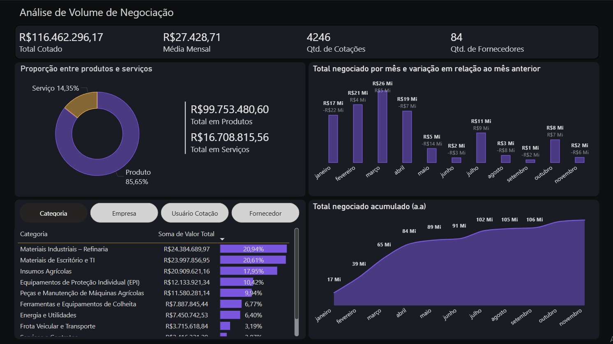

# Portfólio Power BI

Bem-vindo ao meu portfólio de projetos em **Power BI** 🚀.  
Aqui você encontrará dashboards interativos que desenvolvi para diferentes áreas de negócio.

## 📊 Projetos
### 1. Dashboard de Compras - Cotações

 - **Objetivo:** Controlar a qualidade dos serviços prestados pelo setor de compras
- **Principais métricas:** Volume de Negociação, Estimativa de Saving, Lead time de atendimento, controle de inflação interna.
- 

## 📂 Estrutura
- `dashboards/` → arquivos .pbix
- `datasets/` → dados de exemplo
- `imagens/` → capturas de tela
- `docs/` → documentação detalhada
- `scripts/` → ETL e transformações

## 🚀 Como visualizar
1. Baixe os arquivos `.pbix` em `dashboards/`
2. Abra no Power BI Desktop
3. Explore os relatórios interativos

